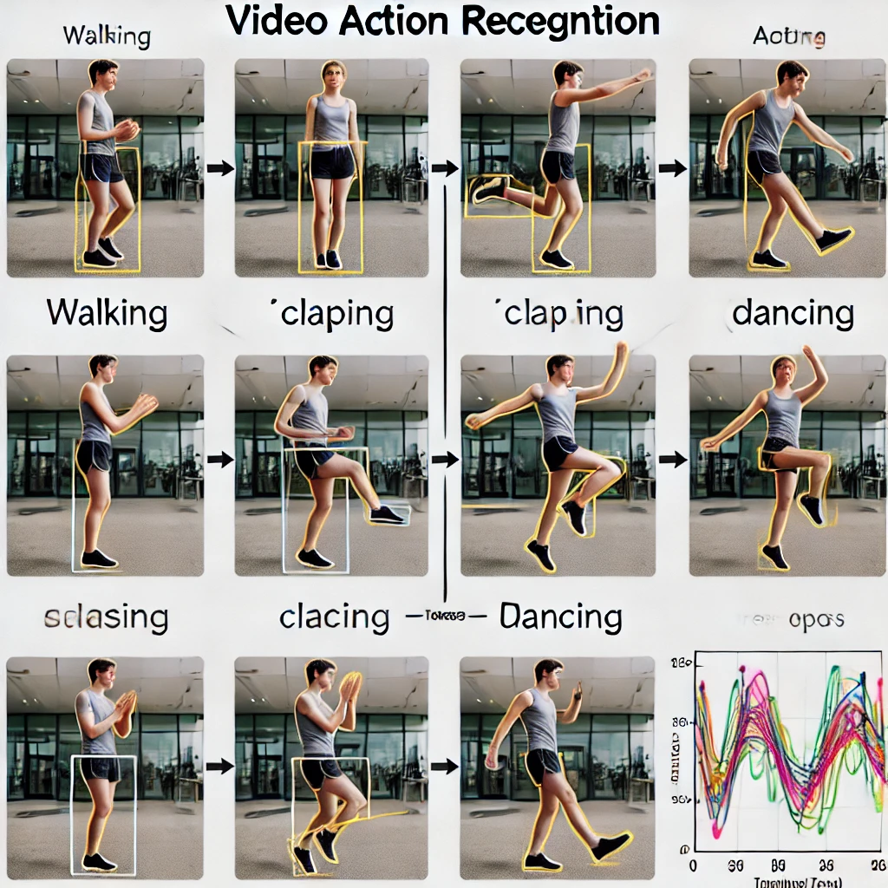

# Video Action Recognition

This project aims to detect and classify human actions in videos using deep learning techniques.

## Project Structure
- `data/`: Contains raw and processed video data.
- `models/`: Contains model definitions and training scripts.
- `notebooks/`: Contains Jupyter notebooks for data preparation and model training.
- `src/`: Contains source code for data processing, inference, and visualization.
- `tests/`: Contains unit tests for the project.

## Getting Started
1. Clone the repository:
   ```bash
   git clone https://github.com/yourusername/video-action-recognition.git



